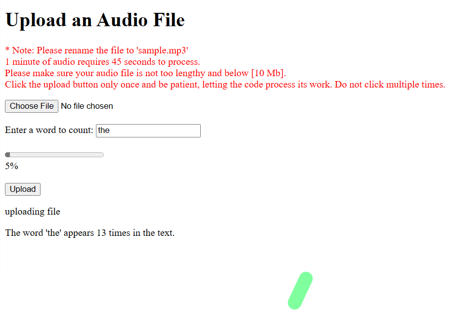
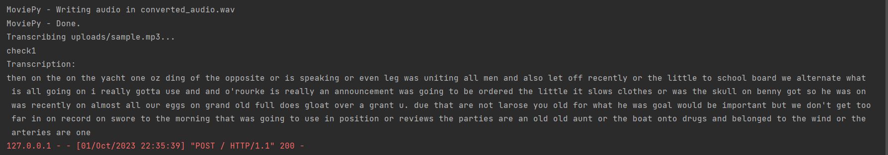

# Rudimentary Prototype

Comparative Analysis of Audio Transcription and Word Occurrence Detection

## This page is used to upload audio file and enter word we want to search in audio and counts the occurance of that word

## The audio is converted in wav format and transcribed to txt

## perhaps there is some memory issue while hosting this project live on render there are some memory limitation on the free version

